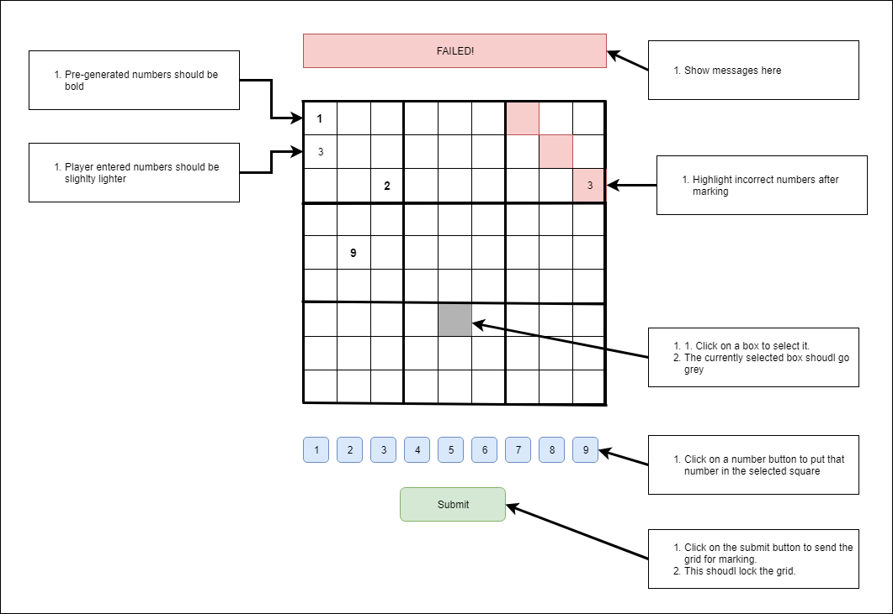

# Design

## 1 - Play a game of Sudoku

---

### Requirements

1. **Must** have a 9 by 9 grid.
1. **Must** have half of the numbers already filled in.
1. Pre-generated numbers **must** be legal Sudoku.
1. **Must** be able to input a number from 1 to 9 in any square of that grid that does not already have a pre-generated number in it.
1. Players **must** be able to edit a number after it has been entered.
1. Players **must** be able to submit a completed grid for marking.
1. Players **must not** be able to amend the grid after they have submitted for marking.
1. When players submit for marking they **must** be informed if they have entered a legal Sudoku grid.
1. If players submit an illegal Sudoku Grid. They **must** be shown which numbers are incorrect.
1. Players **should** be able to reset the game.
1. Resetting the game **should** generate a new sudoku grid.
1. The Grid **should** be sectioned correctly. Each 3 by 3 square is divided from each other and each square is bordered.

### Technical Requirements

1. Use Javascript to build up as much of the grid as possible to reduce boilerplate HTML.
1. Use the concept of "state".

### Wireframe

